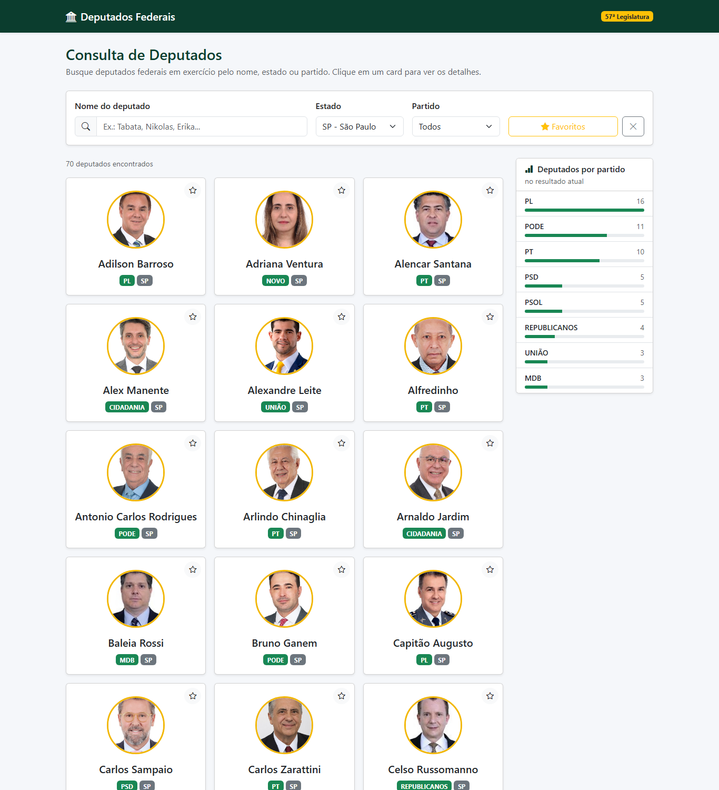
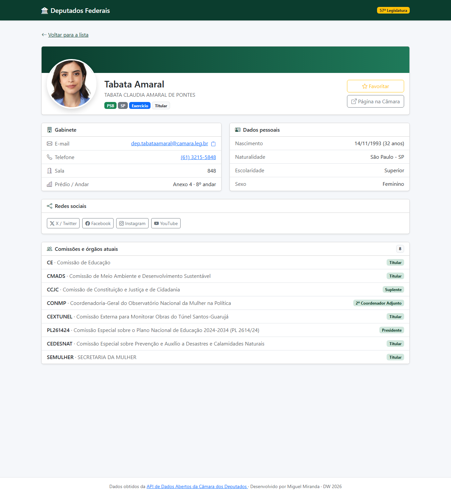

# Sistema de Deputados

Aplicação web para consulta de deputados federais, desenvolvida com **Vue 3** a partir da CLI (`npm create vue@latest`), consumindo a [API de Dados Abertos da Câmara dos Deputados](https://dadosabertos.camara.leg.br/swagger/api.html).

**Aluno:** Miguel Miranda · Desenvolvimento Web 2026

🔗 **Versão em produção:** _adicionar a URL após o deploy_

## Funcionalidades

### Requisitos da atividade
- Busca de deputados por nome (a pesquisa começa automaticamente enquanto o usuário digita)
- Listagem em cards com foto, nome, partido e UF
- Página de detalhes ao clicar em um deputado
- Detalhes com redes sociais, e-mail e telefone do gabinete

### Funcionalidades extras
- **Filtros por estado e partido**, que podem ser combinados com a busca por nome
- **Favoritos**: marque deputados com a estrela; eles ficam salvos no navegador (`localStorage`) e podem ser filtrados
- **Filtros na URL**: a busca é mantida ao voltar da página de detalhes e pode ser compartilhada por link (ex.: `/?uf=MG&partido=PT`)
- **Gráfico de deputados por partido** referente ao resultado atual da busca
- **Comissões e órgãos** de que o deputado participa atualmente
- Dados pessoais: nome civil, data de nascimento com idade, naturalidade e escolaridade
- Localização do gabinete (sala, prédio e andar), telefone clicável e botão para copiar o e-mail
- Link para a página oficial do deputado no site da Câmara
- Paginação com botão "Carregar mais", estados de carregamento, erro (com "Tentar novamente") e lista vazia
- Página 404 para rotas inexistentes
- Layout responsivo com Bootstrap 5 e Bootstrap Icons

## Tecnologias
- Vue 3 (Options API) + Vue Router
- Vite
- Axios
- Bootstrap 5 + Bootstrap Icons (via CDN)

## Estrutura

```
src/
├── components/
│   ├── CardDeputado.vue        # card da listagem
│   ├── CarregandoSpinner.vue   # indicador de carregamento
│   ├── FiltroDeputados.vue     # busca por nome, UF, partido e favoritos
│   ├── RedesSociais.vue        # botões das redes sociais com ícones
│   ├── ResumoPartidos.vue      # gráfico de deputados por partido
│   └── RodapeSite.vue
├── router/index.js             # rotas: lista, detalhes e 404
├── services/camaraApi.js       # chamadas à API da Câmara
├── utils/                      # lista de estados e favoritos (localStorage)
└── views/
    ├── ListaDeputados.vue
    ├── DetalhesDeputado.vue
    └── PaginaNaoEncontrada.vue
```

## Como executar

Pré-requisito: Node.js 22.18 ou superior (ou 24.12+).

```sh
npm install
npm run dev
```

Acesse o endereço exibido no terminal (normalmente http://localhost:5173).

Para gerar a versão de produção:

```sh
npm run build
npm run preview
```

## Deploy

A API da Câmara nem sempre envia o cabeçalho de CORS, o que faz o navegador bloquear algumas respostas. Por isso, as chamadas passam por um proxy em `/api-camara`: no desenvolvimento ele é feito pelo Vite (`vite.config.js`) e em produção pelas regras abaixo.

O projeto já inclui as configurações do proxy e para que as rotas funcionem ao recarregar a página:
- **Vercel**: `vercel.json`. Importe o repositório, defina *Root Directory* como `Miguel Miranda/Atividades/sistema_deputados` e use o preset **Vite**.
- **Netlify**: `public/_redirects`. Use *Base directory* `Miguel Miranda/Atividades/sistema_deputados`, comando `npm run build` e pasta de publicação `dist`.

## Prints

### Listagem de deputados


### Detalhes do deputado

